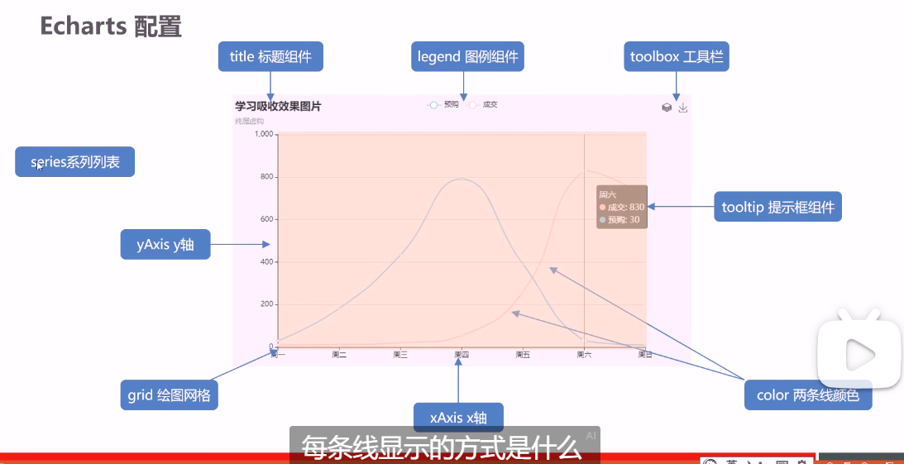
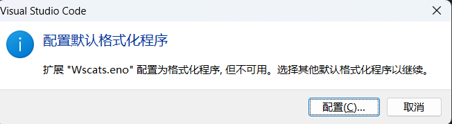
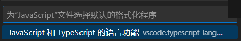

# my-vue2-project笔记

## 在有v-model的输入框中使用value v-model会覆盖value的值
所有应该设置v-model的值 而不是设置html的value

## vuex提交最好在store中 而本地存储最好的页面的方法中
只有vuex成功后返回结果 再进行本地存储

## 样式注意点
-   Element-UI的标签有默认样式 而且优先级很高

此时应该一切从简 可以设置的设置 有一些实在是设置不了的就换标签

-   注意style后面要加scoped防止样式混乱

-   不要使用元素选择器 比如直接 .el-container {} .el-table {}

因为可能会导致后面的样式继承 然后异常难以设置

-   只要能达到功能 样式代码应该是越少越好

比如 ` <el-table-column prop="date" label="日期"></el-table-column>`

的width="100px" 就不应该设置 这样窗口缩小放大会 自动放大放小

-   即使设置了scoped 但在App.vue中的设置依然有效

## 开发应该一切从简 把容错率、控制感提高 而不是去创新❗
做一些容易失控的事情 比如推翻架构 推翻之前的想法

容易兜不住 如果说没有必要 那么就不要去动底层的、思考过的代码

不然当多个思考点同时爆发 人脑将无法面对指数级爆炸的问题数量和串线

## echarts基本配置项

## rem适配
老师的屏幕 1920 / 10 = 192

而他不想分成10份太大 所以 24 1920 / 24(份) = 80(像素)

而我的屏幕 1536 / 10 = 153 不改 那么就是153像素了

### cssrem插件设置 需要点进去后 点击工作区
在进行一次设置才行

### 快捷键设置
如果改了会隐藏 在搜索框中输入CSSRem查看全部 快捷键重新设置

cssrEM: Px To Rem 修改为 ctrl + w

cssrEM: Rem To Px 修改为 ctrl + e

### rem单位、vwvh的使用结合媒体查询、flexible.js的使用
rem会让元素随着窗口放大缩小而改变宽高 相对比窗口比例不变

rem适配是相对于根子号的 这非常不错 可以直接让屏幕元素放大缩小

但是仅仅是放大和缩小 不足以支持有些盒子的宽度细微调节

需要写很多媒体查询 这个时候 如果有必要确实需要自己写很多媒体查询

但也可以引入flexible.js适配 引入flexible.js后需要去改 除于的比例

一开始为24 这里我改成了100

## vscode设置
### 鼠标悬停提示建议取消
在设置搜索中输入editor.hover.enabled

然后取消掉

待: 下面这两个我也设置了false 看情况设置回来

editor.quickSuggestions

editor.suggestOnTriggerCharacters
### 在setting.json中 设置
设置了保存后不自动换行(注意需要重新启动vscode生效)

"editor.wordWrap": "off",

  "vetur.format.defaultFormatterOptions": {
    "js-beautify-html": {
              "wrap_line_length": 240,
              "wrap_attributes": "auto",
              "end_with_newline": false
          },
          "prettyhtml": {
              "printWidth": 100,
              "singleQuote": false,
              "wrapAttributes": false,
              "sortAttributes": false
          }
  }

  破案: 其实是 
  
  使用了这个setting.json配置文件
  
  Sass/Less/Stylus...这个插件关掉后
  
  然后重启vscode 就取消了vue.config.js .js文件的自动换行

  #### setting.json设置
  ` {  
  "workbench.iconTheme": "vscode-icons",  
  
  // --------------------  配置eslint  --------------------  
  "editor.codeActionsOnSave": {  
    "source.fixAll.eslint": "explicit"  
  },  
  "eslint.format.enable": true,  
  "eslint.validate": [  
    "javascript",  
    "vue",  
    "html",  
    "javascriptreact",  
    "vue-html"  
  ],  
  // --------------------  配置eslint  --------------------  
  
  // 设置编辑器的默认格式化工具  
  "editor.defaultFormatter": "esbenp.prettier-vscode",  
  "[html]": {  
    "editor.defaultFormatter": "esbenp.prettier-vscode"  
  },  
  "[javascript]": {  
    "editor.defaultFormatter": "esbenp.prettier-vscode"  
  },  
  "[css]": {  
    "editor.defaultFormatter": "esbenp.prettier-vscode"  
  },  
  "[less]": {  
    "editor.defaultFormatter": "esbenp.prettier-vscode"  
  },  
  "[json]": {  
    "editor.defaultFormatter": "esbenp.prettier-vscode"  
  },  
  
  // 方法括号之间插入空格  
  "javascript.format.insertSpaceBeforeFunctionParenthesis": false,  
  
  // --------------------  vetur 配置  --------------------  
  "[vue]": {  
    "editor.defaultFormatter": "octref.vetur"  
  },  
  "vetur.format.defaultFormatter.html": "js-beautify-html",  
  "vetur.format.defaultFormatter.js": "prettier",  
  "vetur.format.defaultFormatterOptions": {  
    "js": "prettier",  
    "js-beautify-html": {  
      "wrap_attributes": "aligned-multiple" // 属性垂直对齐  
    },  
    "prettyhtml": {  
      "tabWidth": 4,  
      "printWidth": 100,  
      "singleQuote": true,  
      "semi": false,  
      "wrapAttributes": false,  
      "sortAttributes": false  
    },  
    "prettier": {  
      "semi": false,  
      "singleQuote": true,  
      "trailingComma": "none"  
    }  
  },  
  // --------------------  vetur 配置  --------------------  
  
  // --------------------  koro1FileHeader 配置  --------------------  
  "fileheader.customMade": {  
    "Author": "AuthorName",  
    "Date": "Do not edit",  
    "LastEditors": "AuthorName",  
    "LastEditTime": "Do not edit",  
    "Description": ""  
  },  
  "fileheader.cursorMode": {  
    "description": "",  
    "param": "params",  
    "return": ""  
  },  
  "fileheader.configObj": {  
    "createHeader": false,  
    "autoAdd": false,  
    "openFunctionParamsCheck": true,  
    "createFileTime": true,  
    "dateFormat": "YYYY-MM-DD HH:mm:ss",  
    "atSymbol": ["@", "@"],  
    "colon": [": ", ": "]  
  },  
  // --------------------  koro1FileHeader 配置  --------------------  
  
  // --------------------  prettier 配置  --------------------  
  "prettier.useEditorConfig": false,  
  "prettier.semi": false,  
  "prettier.singleQuote": true,  
  "prettier.trailingComma": "none",  
  // --------------------  prettier 配置  --------------------  
  
  "git.confirmSync": false,  
  "security.workspace.trust.untrustedFiles": "open",  
  // "editor.formatOnSave": false,  
  "printWidth": 80 // 或更高的值  
}
  `

### 之后可能遇到重新配置js格式化的提示 点击图2就行了

## 引入路径问题
如果不确定引入的路径是否正确 应该在同级目录下新建一个.html文件

通过link的src去找目标文件 这样路径绝对是对的

## 任务
跟完b站视频 背面试题

适配postcss rem没有响应式问题(postcss垃圾 内部运行外面不清楚 还是要老老实实把代码写上去) ✅

跟完b站 echarts课 ✅

### 1
mock问题

面试题

为什么 {} 老是自动换行 ✅

电脑桌面图标老是自动换行 ✅